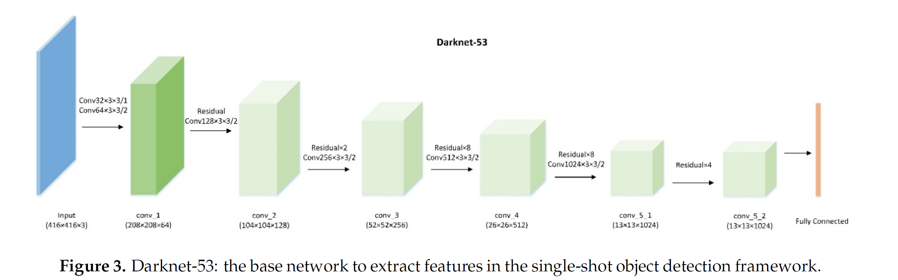

##  Object Detection on Video inputs Using YOLOv3

### [**_Welcome_**](readme.md)&emsp;|&emsp;[Data Set](data-set.md)&emsp;|&emsp;[Introduction and EDA](eda.md)&emsp;|&emsp;[Jupyter Notebook Code](YOLOv3.ipynb)&emsp;|&emsp;[Summary](summary.md)

### Content:
1. [Introduction](#introduction)
2. [Why Yolov3](#why-yolov3)
3. [Implementing Yolov3](#implementing-yolov3)
4. [Results](#results)
5. [Use Case: AI Based Video Annotation And Retrieva](#use-case)
6. [Use Case Results](#use-case-results)
7. [Future Work](#future-work)
8. [REFERENCES](#references)

### Introduction

Object Detection on Video inputs Using YOLOv3

Having examined the performance of SSD300 on images, we now extend our analysis of object detection to video sequences. A video is a sequence of images sampled at a predetermined rate (frames/per second). Given a video, our goal is to track objects in the video as the video plays.

The motivation for this work can lead to the following use cases:
•	Tracking suspicious activities in a crowded field. For example, the model can be retrained to capture instances of backpacks such as the one used by the Boston Bomber, Self-driving cars, etc.
•	Object detection for video searching: Rather than searching for videos based on file names, AI based searches can search for videos based on objects in the video
•	Facial Recognition
At the end of this section, we will implement an algorithm for AI based image searching and annotation.
YOLOv3

Yolo stands for "You Only Look Once". The model divides the input image into an S × S grid. If the center of an object falls into a grid cell, that grid cell is responsible for detecting that object. The model uses a single convolutional network that predicts class probabilities and bounding boxes. [1]

YoloV3 is an improvement over the original Yolo implementation. At 320 × 320 YOLOv3 runs in 22 ms at 28.2 mAP, as accurate as SSD but three times faster [2]

Yolov3 uses the weights of a pretrained DarkNet-53 network to extract images [2].  Darknet is an open source neural network framework written in C and CUDA [3]. The DarkNet-53 architecture consists of a 53-layer convolutional network that is then trained on an Imagenet dataset.

The DarkNet-53 architecture is shown below:

 
### Why Yolov3
As previously mentioned, Yolov3 provides for a very fast object detection model. Because of its performance and popularity, the Yolov3 libraries are integrated with the OpenCV libraries making model creation, training and testing slightly more manageable.
OpenCV
OpenCV stands for Open Source Computer Vision Library. It is a popular computer vision library that helps accelerate implementation of computer vision applications. [4] For this project, the integration of Yolo and OpenCV allows for less problematic management of video frames, reading and writing frames etc. We used the latest version of OpenCV 4 for this project.

### Implementing Yolov3

We used the following pipeline to implement our object detection:
1.	Load the pretrained Yolov3 model and weights from the original paper
2.	Determine the output layers of the model
3.	Detect Object. Perform non-maximum suppression to eliminate redundant overlapping boxes with lower confidences.
4.	Draw Boundary 

The code is attached and includes line by line documentation.

### Results

The mean Average Precision or “mAP score” is the current industry standard for evaluating the performance of Object detection model. To measure the mean Average Precision, we need ground truth knowledge of the video. Specifically, we need to know whether the object was classified correctly and whether the location of the object was properly predicted. This is particularly challenging for videos due of the following reasons:
•	Videos are sampled at a specific frames per second rate to obtain video frames. To that end, we would need to have ground truth knowledge of the video frame at each sampling point and compare this frame with the predictions from the same frame. So synchronization of the ground truth video and test video is very critical.
•	Videos Annotated at Varying sampling rate: If each ground truth video in our test data is annotated at different rate, then we risk comparing unmatched frames. So will need to adjust our model to remain synchronized with the ground truth annotation for us to be able to able to measure mean Average Precision
Unfortunately, we could not find a small test video dataset. Most annotated video datasets contained huge amounts of videos than our limited resources for this project could handle. 

However, using subjective human evaluation, we can conclude that the model performed well. Sample output are in included in the jupyter notebook.  

### Use Case: AI Based Video Annotation And Retrieval

We now turn our attention to one possible Use Case of Object Detection on Video inputs. Up until recently, searches of videos relied on the name of the video or if the video was on a website, the general text around the website, to retrieve the video.

In this project, we propose that given that we call detect objects in a video, can we use that information to:
1.	Retrieve videos that meet a search criterion by “looking” into videos 
2.	Resolving the lack of annotation videos mentioned above and developing an AI automated process of annotating videos. 
For (2) above, the detection process produces the class and we well the values tx, ty, Cx, cy. We also have the sampling rate.

 

So we have enough information to create an annotation file that can be used to train other models. The challenge here remains that we do not have ground truth information. To resolve this, we can run several passes of the video into this model, or other variation of the model, log the data and then use unsupervised machine learning techniques to determine the appropriate acceptable boundaries and parameters. We did not get time to work on this, so will leave this to another project.

For (1) above, we implemented a retrieval process where given a search, the model will return all videos that contain the search criteria. For example, “show all videos that have a person and elephant in them”.

File Name	File Location	Classes Detected
video_01.mp4	data/videos	[person, dog, horse]
video_03.mp4	data/videos	[bagpack, bottle]
video_05.mp4	data/videos	[car, truck, trafficlight]

In the table above, we only show three variables, but the table can be expanded include metadata information from the video e.g. location video was shot, time/date of video was shot, length of video, Focal length, etc. 
1.	We save all the videos on storage location e.g. directory with each video having a unique primary identifier
2.	For all the videos in the directory, if the video has not been added to the annotation database, we detect the objects in the video, and update the annotation database. In practice, this annotation job could be done in a big data environment using Apache Spark or equivalent environments.
3.	We search the annotation library and return videos that meet the search criteria

The jupyter code is attached and includes line by line documentation.

### Use Case Results

The system can retrieve videos that meet search criteria

